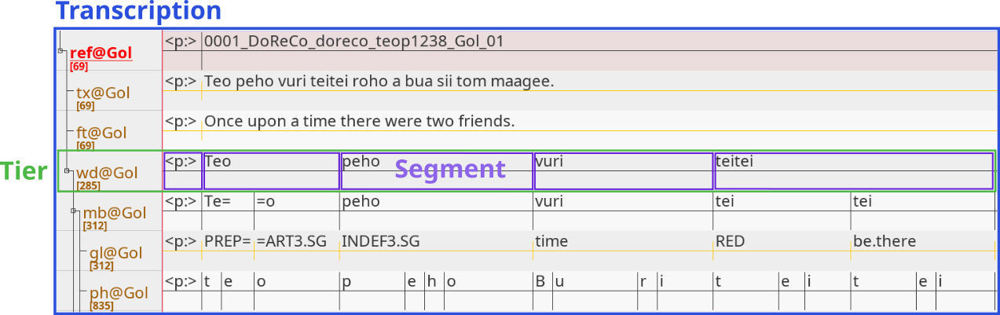

# Basics of Corflow

This tutorial introduces the main concepts and classes of Corflow.

## Importing and Exporting Files

Corflow is both a tool to (1) manipulate a file and (2) to change a file's format. Corflow currently supports the linguistic formats of the following linguistic tools:

|Tool|Format|
|---|---|
|ELAN|.eaf|
|Praat|.TextGrid|
|EXMARaLDA|.xml|
|Pangloss|.xml|
|Transcriber|.trs|

To either import or export a file containing linguistic data, import the module, whose name is made up of (1) the name of the tool (2) prefixed with either _from_ or _to_, and use the module's function with the same name. E.g. to import and export an .eaf file, create a Python script with the following code:

```python
#Import the ELAN corflow modules.
from corflow import fromElan,toElan
#Path to the .eaf file.
file = "doreco_teop1238_Gol_01.eaf"
#Importing the .eaf file.
trans = fromElan.fromElan(file)
#Exporting the .eaf file.
toElan.toElan("new_file.eaf",trans)
```

Importing for example `toPraat` and using `toPraat.toPraat` instead of `toElan.toElan`, Corflow makes it possible to convert a file's format.

## Classes and Objects

The following edited screenshot taken of the file `doreco_teop1238_Gol_01.eaf` in ELAN illustrates Corflow's model:



Importing a file using Corflow creates a `Transcription` object. A `Transcription` object contains (multiple) `Tier` objects and a `Tier` object contains (multiple) `Segment` objects. `Transcriptions`, `Tiers` and `Segments` relate (1) linearly and (2) hierarchically to each other as well as share a number of attributes and methods (as they all belong to the root class `Conteneur`. In what follows, I illustrate common attributes and methods used in Corflow.

## Help

To get information about an object's attributes and methods call the `help` function with the respective object as an argument or read the [Corflow GitHub Wiki](https://github.com/DoReCo/corflow/wiki).

```python
#Import the respective class.
from corflow.Transcription import Transcription, Tier, Segment
#Create an object from that class.
trans = Transcription()
tier = Tier()
seg = Segment()
#Call the help function.
help(trans)
help(tier)
help(seg)
```

## Common Attributes and Methods

The following table shows which common attributes and methods to use on which objects to obtain meaningful information:

|Attribute/Method|Transcription|Tier|Segment|
|---|---|---|---|
|elem|x|x||
|name|x|x|x|
|content|||x|
|start|x|x|x|
|end|x|x|x|
|struct||x|x|
|metadata|x|x|x|
|index()||x|x|
|parent()||x|x|
|children()|x|x|x|
|findName()|x|x|x|
|getIndex()|x|x||
|getTime()|x|x||
|remove()|x|x||
|setParent()||x|x|

### Accessing Objects by their Index

The `.elem` attribute is a list containing all objects belonging to an object. The following example accesses the first tier and its second segment of the transcription `trans`:

```python
from corflow import fromElan
file = "doreco_teop1238_Gol_01.eaf"
trans = fromElan.fromElan(file)
#Get the first tier.
tier = trans.elem[0]
#Get the first segment of the first tier.
seg = tier.elem[1]
print(f"transcription: {trans.name}")
print(f"first tier: {tier.name}")
print(f"second segment: {seg.content}")
```

Output:

```console
transcription: doreco_teop1238_Gol_01
first tier: ref@Gol
second segment: 0001_DoReCo_doreco_teop1238_Gol_01
```

### Accessing Objects by their Name (regular expression)

The methods `.findName` and `.findAllName` return one or all objects, whose `.name` attribute match a given regular expression. The following example accesses (1) the word tier only and (2) the morph and gloss tier:

```python
from corflow import fromElan
file = "doreco_teop1238_Gol_01.eaf"
trans = fromElan.fromElan(file)
#Get the word tier.
wd_tier = trans.findName("wd@")
#Get the morph and the gloss tier.
mb_gl_tiers = trans.findAllName("(mb|gl)@")
print(f"word tier: {wd_tier.name}")
print(f"morph and gloss tier:\n{[tier.name for tier in mb_gl_tiers]}")
```

Output:

```console
word tier: wd@Gol
morph and gloss tier:
['mb@Gol', 'gl@Gol']
```

To access a `Segment` object based on their `.content` attribute, you can use the `get_segs` function from the [general_functions](../../general_functions.py) script (more on that in the [third tutorial]()).

### Name and Content

`.name` contains an object's name. If it's a `Transcription`, `.name` contains the file's name without the file extension. If it's a `Segment`, `.name` contains the unique ID of that segment. To access a segment's string, use `.content` instead:

```python
from corflow import fromElan
file = "doreco_teop1238_Gol_01.eaf"
trans = fromElan.fromElan(file)
tier = trans.elem[0]
seg = tier.elem[1]
print(f"transcription: {trans.name}")
print(f"tier: {tier.name}")
print(f"segment name: {seg.name}")
print(f"segment content: {seg.content}")
```

Output:

```console
transcription: doreco_teop1238_Gol_01
tier: ref@Gol
segment name: a1
segment content: 0001_DoReCo_doreco_teop1238_Gol_01
```

### Time

`.start` and `.end` contain an object's start and end time respectively (in seconds):

```python
from corflow import fromElan
file = "doreco_teop1238_Gol_01.eaf"
trans = fromElan.fromElan(file)
tier = trans.elem[0]
seg1 = tier.elem[0]
seg2 = tier.elem[1]
print(f"transcription: {trans.start} -- {trans.end}")
print(f"tier: {tier.start} -- {tier.end}")
print(f"first segment: {seg1.start} -- {seg1.end}")
print(f"second segment: {seg2.start} -- {seg2.end}")
```

Output:

```console
transcription: 0.0 -- 116.0
tier: 0.0 -- 116.0
first segment: 0.0 -- 0.06
second segment: 0.06 -- 2.84
```

### Structure

`.struct` contains the object to which an object belongs to (is an element of):

```python
from corflow import fromElan
file = "doreco_teop1238_Gol_01.eaf"
trans = fromElan.fromElan(file)
tier = trans.elem[0]
seg = tier.elem[0]
print(f"transcription: {trans.name}")
print(f"tier: {tier.name}")
print(f"structure of the first tier: {tier.struct.name}")
print(f"structure of the first segment: {seg.struct.name}")
```

Output:

```console
transcription: doreco_teop1238_Gol_01
tier: ref@Gol
structure of the first tier: doreco_teop1238_Gol_01
structure of the first segment: ref@Gol
```

### Index

`.index()` returns the index an object has in the list of elements of the object it belongs to:

```python
from corflow import fromElan
file = "doreco_teop1238_Gol_01.eaf"
trans = fromElan.fromElan(file)
ph_tier = trans.findName("ph@")
#Get the object's index.
ind = ph_tier.index()
print(f"Index of tier /{ph_tier.name}/: {ind}")
print(f"Name of the tier with index {ind}: {trans.elem[ind].name}")
```

Output:

```console
Index of tier /ph@Gol/: 6
Name of the tier with index 6: ph@Gol
```

## Remove an Object

`.remove()` removes an object from its structure. `.pop()` does the same, but uses the index of the object instead of the object itself:

```python
from corflow import fromElan
file = "doreco_teop1238_Gol_01.eaf"
trans = fromElan.fromElan(file)
wd_tier = trans.findName("wd@")
print(f"First four words: {[seg.content for seg in wd_tier.elem[:4]]}")
word = wd_tier.elem[0]
#Removes a segment (word) using that segment.
wd_tier.remove(word)
print(f"After removing the first word: {[seg.content for seg in wd_tier.elem[:3]]}")
#Removes the first segment (word) from the word tier.
wd_tier.pop(0)
print(f"After removing the next word: {[seg.content for seg in wd_tier.elem[:2]]}")
```

Output:

```console
First four words: ['<p:>', 'Teo', 'peho', 'vuri']
After removing the first word: ['Teo', 'peho', 'vuri']
After removing the next word: ['peho', 'vuri']
```

### Parents and Children

`.parent()` returns an object's direct parent object or None, if none exists. It can be used recursively. `.parents()` returns a list containing all (direct and indirect) parents an object has:

```python
from corflow import fromElan
file = "doreco_teop1238_Gol_01.eaf"
trans = fromElan.fromElan(file)
ph_tier = trans.findName("ph@")
#Get the parent tier of phone tier.
parent_tier = ph_tier.parent()
print(f"direct parent tier of /phone tier/: {parent_tier.name}")
print(f"grandparent tier of /phone tier/: {parent_tier.parent().name}")
#Get all parent tiers of phone tier.
parent_tiers = ph_tier.parents()
print(f"all parent tiers of /phone tier/: {[par.name for par in parent_tiers]}")
```

Output:

```console
direct parent tier of /phone tier/: mb@Gol
grandparent tier of /phone tier/: wd@Gol
all parent tiers of /phone tier/: ['ref@Gol', 'wd@Gol', 'mb@Gol']
```

`.children()` returns a list containing each direct child object of an object. `.allChildren()` returns a list containing all (direct and indirect) child objects:

```python
from corflow import fromElan
file = "doreco_teop1238_Gol_01.eaf"
trans = fromElan.fromElan(file)
ref_tier = trans.findName("ref@")
#Get only the direct child tiers of ref tier.
direct_child_tiers = ref_tier.children()
print(f"direct child tiers of /reference tier/:")
print([tier.name for tier in direct_child_tiers])
#Get all child tiers of ref tier.
all_child_tiers = ref_tier.allChildren()
print(f"all child tiers of /reference tier/")
print([tier.name for tier in all_child_tiers])
```

Output:

```console
direct child tiers of /reference tier/:
['tx@Gol', 'ft@Gol', 'wd@Gol']
all child tiers of /reference tier/
['tx@Gol', 'ft@Gol', 'wd@Gol', 'mb@Gol', 'gl@Gol', 'ph@Gol', 'doreco-mb-algn@Gol', 'gloss', 'mc-zero']
```

Both methods collect child objects regardless to which structure they belong to:

```python
from corflow import fromElan
file = "doreco_teop1238_Gol_01.eaf"
trans = fromElan.fromElan(file)
morph_tier = trans.findName("mb@")
mb_seg = morph_tier.elem[3]
children = mb_seg.children()
print(f"child segments of /{mb_seg.content}/")
print([seg.content for seg in children])
```

Output:

```console
child segments of /peho/
['INDEF3.SG', 'p', 'e', 'h', 'o', '****']
```

`.childDict()` and `.allChildDict()` instead return a dictionary, with (1) the structure of a child element as a _dictionary key_ and (2) a list containing child elements belonging to a structure as a _dictionary value_:

```python
from corflow import fromElan
file = "doreco_teop1238_Gol_01.eaf"
trans = fromElan.fromElan(file)
morph_tier = trans.findName("mb@")
mb_seg = morph_tier.elem[3]
children = mb_seg.childDict()
for tier,segs in children.items():
    print(f"child segments belonging to child tier: {tier.name}")
    print([seg.content for seg in segs])
```

Output:

```console
child segments belonging to child tier: gl@Gol
['INDEF3.SG']
child segments belonging to child tier: ph@Gol
['p', 'e', 'h', 'o']
child segments belonging to child tier: doreco-mb-algn@Gol
['****']
```