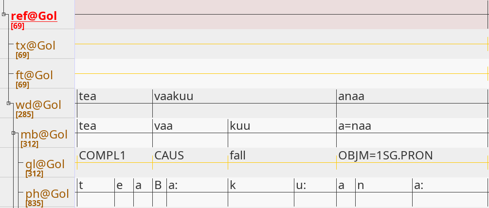

# Copy and add Tiers

This tutorial shows how to copy existing tiers to a `Transcription` object and change the content of their segments based on regular expressions.

## Copy and add Objects to Structures

`Tiers` and `Segments` might have to be changed while keeping the original `Tiers` and `Segments` as they were. *Tokenization* tasks are such cases, where existing `Tiers` and `Segments` might have to be copied and added to the `Transcription` first before being changed. Take a look at the following screenshot taken of the `.eaf` file `doreco_teop1238_Gol_01.eaf` from the older DoReCo version 1.2:

<!---->


To add a copy of a pre-existing object (`Tier` or `Segment`) to its structure, use the `.add()` method. If we want to copy and add a `Tier`, we call the `.add()` method on a `Transcription` object. If we want to copy and add a `Segment`, we call the `.add()` method on a `Tier` object.

The following code imports an `.eaf` file and creates a `Transcription`.

```python
from corflow import fromElan,toElan

#Path to .eaf-file.
eaf = "RG_16_fixed.eaf"
#Create a transcription object.
trans = fromElan.fromElan(eaf,encoding="utf-8")
```

Continuing from there, the next code copies and adds the first tier as a *root* tier and the second tier as a *child* tier to the `Transcription`. A *root* tier is defined as a tier with no parent tier and a *child* tier as a tier having a parent.

```python
#Get tiers.
first_tier = trans.elem[0]
second_tier = trans.elem[1]

#Copy and add tier as a root tier.
trans.add(-1,first_tier)

#Copy and add tier as a child tier.
trans.add(-1,second_tier,second_tier)
```

When copying and adding an existing object to a structure, 


Finally, (4) the names of the new tiers are changed and (5) the `Transcription` is saved as a new `.eaf` file.