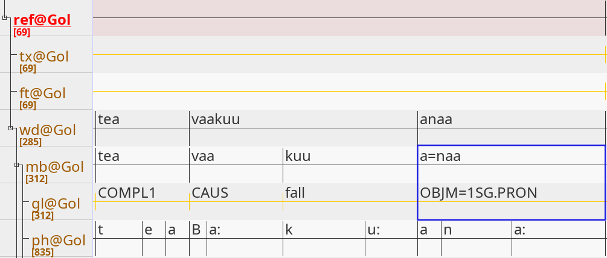
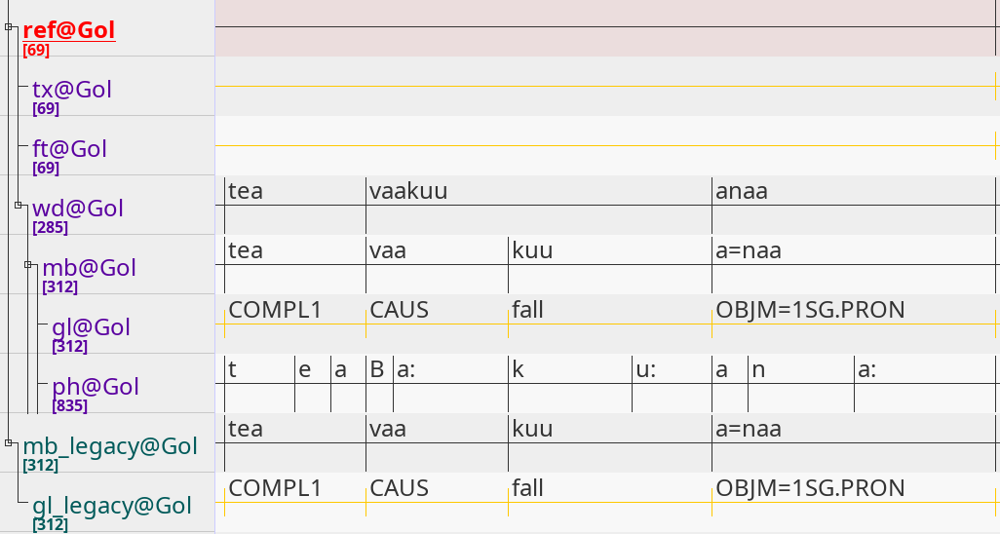

# Copy and add Tiers

This tutorial shows how to copy and add an existing `Tier` to a `Transcription` object. The respective Python scripts are [`02_copy_tiers_extensive.py`](02_copy_tiers_extensive.py), [`02_copy_tiers_short.py`](02_copy_tiers_short.py) and [`02_copy_tiers_multiple_speakers.py`](02_copy_tiers_multiple_speakers.py).

## Copy and add Objects to Structures

Some processing tasks involve copying `Segments` and `Tiers`, e.g. to preserve original tiers before proceeding to modify the new tiers. One such use case is *tokenization*, which will be discussed in more detail in `03_tokenize_segments`. Take a look at the tiers and segments in the file `doreco_teop1238_Gol_01.eaf` from *Teop* taken from DoReCo version 1.2:



The screenshot highlights two `Segments`: *a=naa* on the morph tier and *OBJM=1SG.PRON* on the gloss tier, both daughters of the word *anaa*. This is a case where we would like to perform tokenization, as *a=naa* actually consists of two linguistic units: the proclitic *a=* and the root *naa*, with their respective glosses being *OBJM=* and *1SG.PRON*. Before carrying out the tokenization, we first want to create backup copies of the respective tiers.

Corflow provides the `.add()` method to copy and add existing objects. In order to copy and add an existing `Tier` to a `Transcription`, we call the `.add()` method on a `Transcription` object. To copy and add a `Segment` to a `Tier`, we would call the `.add()` method on a `Tier` object.

We start by importing the .eaf file, creating a `Transcription` object and finding the morph and gloss tier using regular expressions (alternatively, one can call the `.getName()` method on the transcription with the exact name of a tier as a string to obtain that tier).

```python
# Importing the ELAN corflow modules.
from corflow import fromElan,toElan
# Path to .eaf file.
eaf = "doreco_teop1238_Gol_01.eaf"
# Creating a transcription object (importing the .eaf file).
trans = fromElan.fromElan(eaf,encoding="utf-8")
# Get the morph tier.
mb_tier = trans.findName("mb@")
# Get the gloss tier.
gl_tier = trans.findName("gl@")
```

We can check whether we accessed the correct tiers by printing their names:

```python
# Print the names of the morph and gloss tier.
print(f"mb tier: {mb_tier.name}")
print(f"gl tier: {gl_tier.name}")
```

Output:

```console
mb tier: mb@Gol
gl tier: gl@Gol
```

Some .eaf files contain annotations for multiple speakers, and therefore multiple identical tier structures, one for each speaker. For example, the file `doreco_goem1240_c00JMquest2.eaf` from *Goemai* has two different speakers and therefore two different sets of morph and gloss tiers. The following code snippet shows how to access the first morph and gloss tiers and then *all* morph and gloss tiers:

```python
# Importing the ELAN corflow modules.
from corflow import fromElan,toElan
# Path to .eaf file.
eaf = "doreco_goem1240_c00JMquest2.eaf"
# Creating a transcription object (importing the .eaf file).
trans = fromElan.fromElan(eaf,encoding="utf-8")
# Get the first morph tier.
first_mb_tier = trans.findName("mb@")
# Get all morph tiers.
mb_tiers = trans.findAllName("mb@")
# Get the first gloss tier.
first_gl_tier = trans.findName("gl@")
# Get all gloss tiers.
gl_tiers = trans.findAllName("gl@")
# Print the name of all found tiers.
print(f"first morph tier: {first_mb_tier.name}")
print(f"all morph tiers: {[t.name for t in mb_tiers]}")
print(f"first gloss tier: {first_gl_tier.name}")
print(f"all gloss tiers: {[t.name for t in gl_tiers]}")
```

Output:

```console
first morph tier: mb@J
all morph tiers: ['mb@J', 'mb@M']
first gloss tier: gl@J
all gloss tiers: ['gl@J', 'gl@M']
```

Accessing only the first set of tiers ignores all other sets of tiers, which may be problematic given the order of tiers and speakers may differ across files. To be on the safe side, one can (1) search for all morph tiers and (2) pick the corresponding gloss tier, which is the child tier of the morph tier:

```python
# Importing the ELAN corflow modules.
from corflow import fromElan,toElan
# Path to .eaf file.
eaf = "doreco_teop1238_Gol_01.eaf"
# Creating a transcription object (importing the .eaf file).
trans = fromElan.fromElan(eaf,encoding="utf-8")
# Find all morph tiers and iterate through them.
for mb_tier in trans.findAllName("mb@"):
    # Iterate through all child tiers of a morph tier.
    for ch_tier in mb_tier.children():
        # Get the gloss tier.
        if ch_tier.name.startswith("gl@"):
            #...
```

In what follows, knowing our .eaf file from Teop only contains one set of morph and gloss tiers, we will continue with the previous approach accessing the morph and gloss tier independently of each other.

Having accessed the morph and gloss tier, we copy and add the morph tier as a new tier to the transcription by calling the `.add()` method on the transcription. The `.add()` method has three relevant parameters:

1. **index**: Index of the new object.
2. **elem**: The object we want to copy and add.
3. **parent**: The parent object of the object we want to copy and add.

We (1) specify the index of the new copied morph tier as the last (newest) tier in the list of tiers with `-1` (using `len(trans)` instead would have had the same effect), (2) specify the morph tier as the object we want to copy and add, and (3) return the new tier:

```python
#Copy and add the morph tier.
new_mb_tier = trans.add(-1,mb_tier)
```

When omitting the third parameter, the `.add()` method defaults the value of the third parameter to `None`. We thereby add the morph tier as a *root* tier to the transcription. A *root* tier is defined as a tier with no parent tier. Objects, whose parent is defined as `None`, are root objects (this applies to `Tiers` and `Segments`).

After copying and adding the new morph tier, we can change its name by accessing its `name` attribute. I want to add the suffix *_legacy* to the name of the tier indicating the status of the tier. If I know the name of the tier in advance, I can manually define the name of the new tier:

```python
# Define the name of the new morph tier.
new_mb_tier.name = "mb_legacy@Gol"
```

If we want to copy, add and rename multiple (morph) tiers across multiple files, we will need an automated solution. Here, we can (1) split the name of the original morph tier, (2) add the suffix *_legacy* at the desired position and (3) change the name of the new morph tier. The end result will be the same.

```python
# Split the name of the morph tier into three parts:
# (1) "mb", (2) "@" and (2) the speaker "Gol".
mb_tier_name_split = mb_tier.name.partition("@")
# Add the suffix "_legacy" to "mb".
new_name = mb_tier_name_split[0] + "_legacy"
# Add the remaining parts of the original name
# and change the name of the new morph tier.
new_mb_tier.name = new_name + mb_tier_name_split[1] + mb_tier_name_split[2]
```

Having copied, added and renamed the morph tier, we do the same with the gloss tier. This time, however, we specify its parent tier as the newly added morph tier, since we want the gloss tier and its segments corresponding to the new morph tier and its segments:

```python
# Copy and add the gloss tier.
new_gl_tier = trans.add(-1,gl_tier,new_mb_tier)
```

Afterwards, we adjust the name of the new gloss tier as we did before for the new morph tier.

```python
# Split the name of the gloss tier into three parts:
# (1) "gl", (2) "@" and (2) the speaker "Gol".
gl_tier_name_split = gl_tier.name.partition("@")
# Add the suffix "_legacy" to "gl".
new_name = gl_tier_name_split[0] + "_legacy"
# Add the remaining parts of the original name
# and change the name of the new gloss tier.
new_gl_tier.name = new_name + gl_tier_name_split[1] + gl_tier_name_split[2]
```

There is one last step before saving and exporting the transcription as a new .eaf file: When copying and adding a new tier, each segment of the original tier gets copied and added to the new tier as well. These new segments share the same attribute values as the original segments, including the internal annotation ID of each segment. Annotation ID's must be unique for each segment across an .eaf file, however; if they are not, the resulting .eaf file is corrupted and cannot be opened in ELAN. To prevent this from happening, all ID's on all tiers have to be renamed. The particular annotation ID is not important as long as it is unique per file. By convention, the annotation ID of a segment consists of the letter *a* followed by a unique number.

```python
# Renaming the annotation ID of all segments
# to make sure, that every segment has a
# unique annotation ID.
incr = 0
for tier in trans:
    incr = tier.renameSegs("a",incr)
```

Finally, the transcription is saved and exported as the new .eaf file `doreco_teop1238_Gol_01_copied_legacy_tiers.eaf`:

```python
# Exporting the transcription as a new .eaf file.
toElan.toElan(trans.name + "_copied_legacy_tiers" + ".eaf",trans)
```

The structure of the new file:



## Scripts

All code snippets appearing in the tutorial are included in one of the three Python scripts:

1. [`02_copy_tiers_extensive.py`](02_copy_tiers_extensive.py):
2. [`02_copy_tiers_short.py`](02_copy_tiers_short.py).
3. [`02_copy_tiers_multiple_speakers.py`](02_copy_tiers_multiple_speakers.py).

All three scripts import the .eaf file [`doreco_teop1238_Gol_01.eaf`](doreco_teop1238_Gol_01.eaf), copy and add the morph and its corresponding gloss tier, rename both new tiers and finally save the transcription as the file [`doreco_teop1238_Gol_01_copied_legacy_tiers.eaf`](doreco_teop1238_Gol_01_copied_legacy_tiers.eaf). While the first and third script extensively rename the new tiers, the second script does this manually. While the first and second script assume that the .eaf file only contains one set of morph and gloss tiers, the third script searches through all possibly available morph and gloss tiers.

## References

The .eaf files used in this tutorial:

* `doreco_teop1238_Gol_01.eaf` from *Teop* from DoReCo 1.2:<br><br>Mosel, Ulrike. 2022. Teop DoReCo dataset. In Seifart, Frank, Ludger Paschen and Matthew Stave (eds.). Language Documentation Reference Corpus (DoReCo) 1.2. Berlin & Lyon: Leibniz-Zentrum Allgemeine Sprachwissenschaft & laboratoire Dynamique Du Langage (UMR5596, CNRS & Université Lyon 2). https://doreco.huma-num.fr/languages/teop1238 (Accessed on 02/11/2024). DOI:10.34847/nkl.9322sdf2

* `doreco_goem1240_c00JMquest2.eaf` from *Goemai* from DoReCo 1.2:<br><br>Hellwig, Birgit. 2022. Goemai DoReCo dataset. In Seifart, Frank, Ludger Paschen and Matthew Stave (eds.). Language Documentation Reference Corpus (DoReCo) 1.2. Berlin & Lyon: Leibniz-Zentrum Allgemeine Sprachwissenschaft & laboratoire Dynamique Du Langage (UMR5596, CNRS & Université Lyon 2). https://doreco.huma-num.fr/languages/goem1240 (Accessed on 28/11/2024). DOI:10.34847/nkl.b93664ml

* The DoReCo database:<br><br>Seifart, Frank, Ludger Paschen & Matthew Stave (eds.). 2022. Language Documentation Reference Corpus (DoReCo) 1.2. Berlin & Lyon: Leibniz-Zentrum Allgemeine Sprachwissenschaft & laboratoire Dynamique Du Langage (UMR5596, CNRS & Université Lyon 2). DOI:10.34847/nkl.7cbfq779

