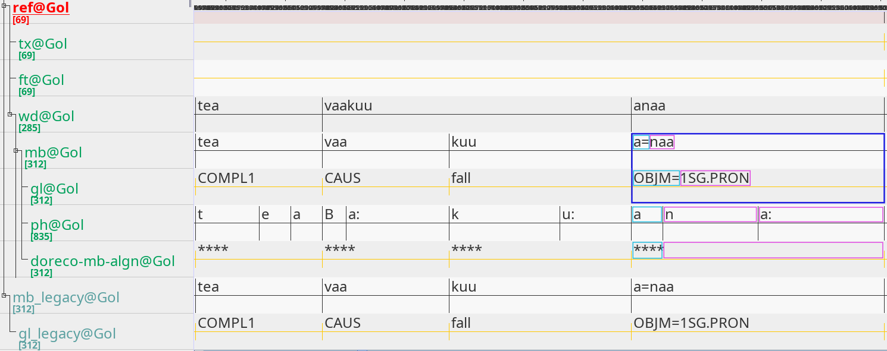

# Tokenize Segments

This tutorial shows how to tokenize (split) segments.

## Introduction

The [previous tutorial](../02_copy_tiers/README.md) showed and explained how to copy existing `Tiers` and add them as either independent *root* or dependent *child* tiers to a `Transcription`. These tiers were copied and added in order to preserve their original segmentation before being altered and further processed. <!--before being altered in the upcoming tokenization--> The following tutorial will show how to (1) identify certain `Segments` based on their annotation value and (2) tokenize them. We will work with the .eaf file `doreco_teop1238_Gol_01_copied_legacy_tiers.eaf` created in the previous tutorial. Alternatively, one can just as well work with the original .eaf [`doreco_teop1238_Gol_01.eaf`](../02_copy_tiers/doreco_teop1238_Gol_01.eaf) instead.

## Starting Point

The screenshot taken of the .eaf file `doreco_teop1238_Gol_01_copied_legacy_tiers.eaf` from *Teop* from the older DoReCo version 1.2 highlights one instance of `Segments` (in a blue rectangle), which have to be tokenized: The morph *a=naa* and its gloss *OBJM=1SG.PRON* corresponding to the word *anaa*:

Both segments contain two separate units: *a=naa* contains the proclitic *a=* and the root *naa* with their respective glosses being *OBJM=* and *1SG.PRON*. Each segment has to be split into two separate segments (highlighted by green and red rectangles), such that each morph and gloss constitutes its own segment. But what does *splitting* a segment mean in particular? The next section [*Excursion: Concept behind Splitting a Segment*](#excursion-concept-behind-splitting-a-segment) answers this question. The section [*Splitting a Segment*](#splitting-a-segment) right after the next one instead explains how to use the `split_seg()` function located in the [`general_functions.py`](../../general_functions.py) script in order to split a segment.

## Excursion: Concept behind Splitting a Segment

First and foremost, splitting a segment involves (1) adding a new segment next to the current segment and adjusting the (2) content (annotation value) as well as the (3) start and end time of the new and current segment. Furthermore, when adding a segment, the (4) child and parent segments of the new segment have to be established. Lastly, depending on the hierarchy of the tier, (5) additional new segments may have to be added, if the tier has child tiers. In what follows, I will go through each step involved when splitting a segment and explain it.

<!--By default, when adding a new segment (annotation unit) next to another segment in ELAN, the current segment would be split evenly such that the current and new segment would have the same time span.-->

When we (1) add a new segment, we create a new `Segment` object and insert it to the list of elements of a `Tier`. 

Take a look at the previous screenshot and consider the hierarchy of the tiers, whose segments we want to split there: The morph tier is a child tier of the word tier and the parent tier of the (1) gloss, (2) phone and (3) special *doreoco-mb-algn@* tier. When we add a new segment on the morph tier and one on the gloss tier, we want the new segment on the morph tier to be a child segment of the word segment *anaa* and at the same time be a parent segment of the new segment on the gloss tier. In other words, we have to consider 

Furthermore, while 

## Splitting a Segment